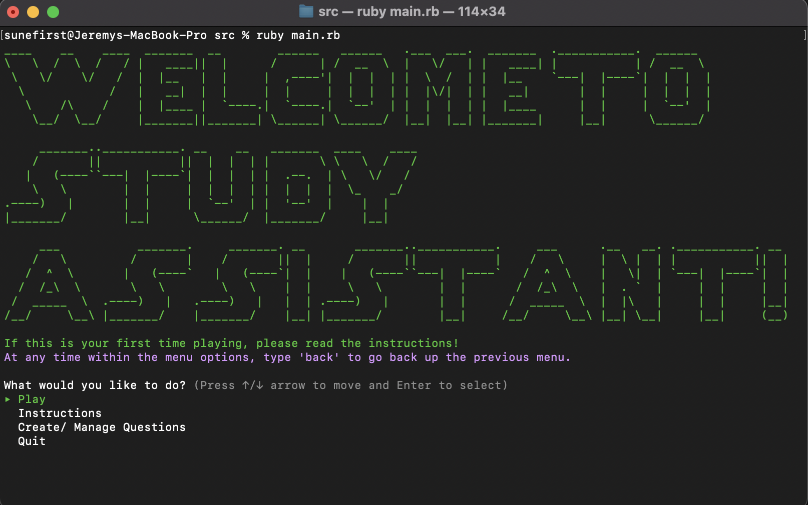
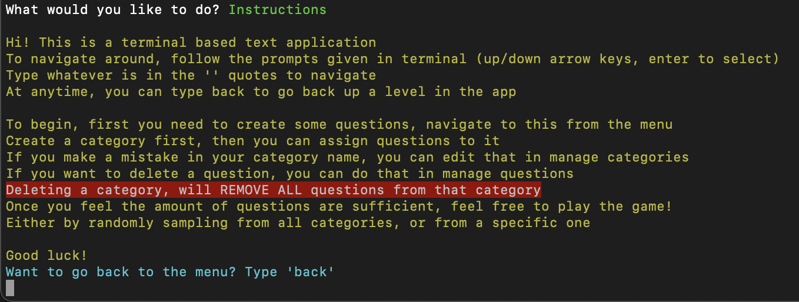
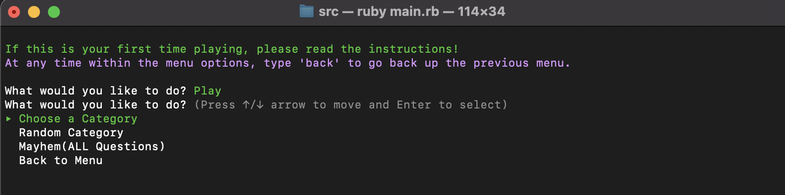
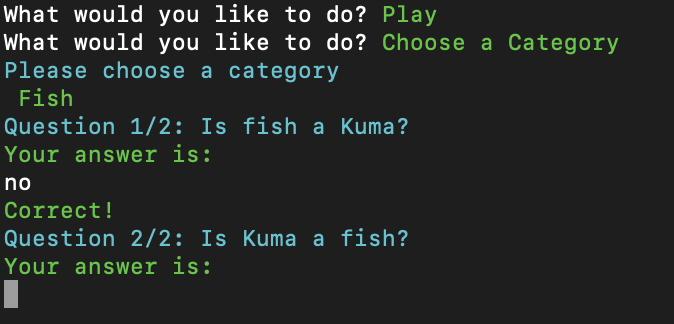
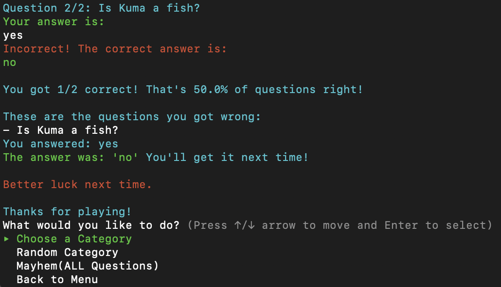
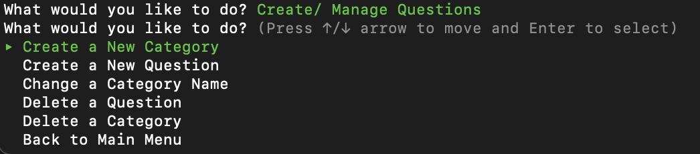
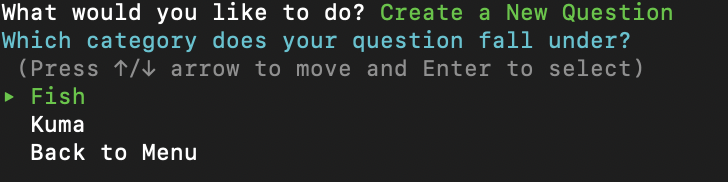
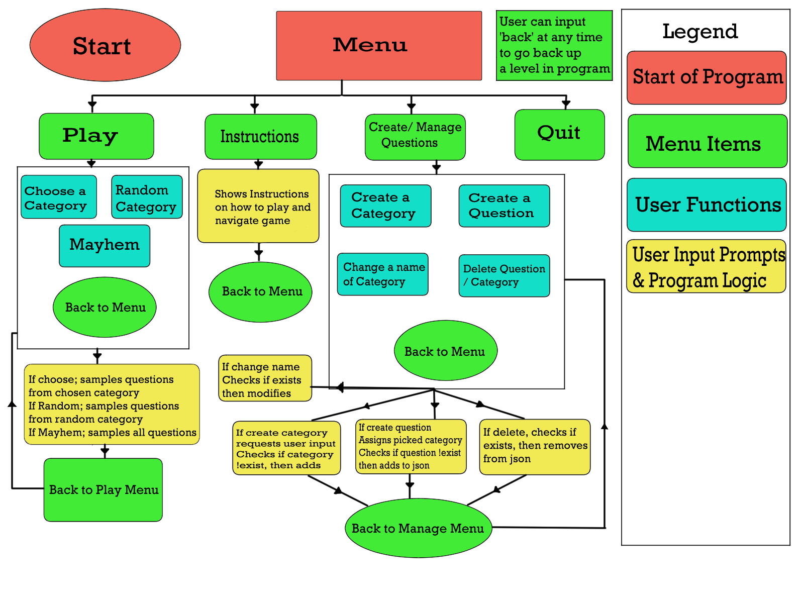
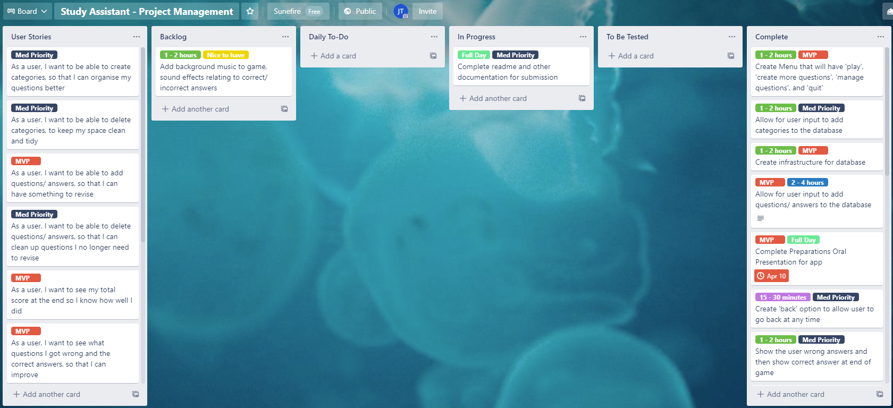

# Study Assistant Application
 ## Table of Contents:  
- [Links](#Links)  
- [Software Development Plan](#Software-development-plan)  
- [Instructions on how to use](#Target-Audience-Usage)
- [Functionality & Features](#Functionality-and-Features)
- [User Interaction and Experience](#User-interaction-and-experience)  
- [Control Flow Diagram](#Control-flow-diagram)  
- [Implementation Plan](#Implementation-Plan)  
- [Testing](#Testing)
- [Help Documentation](#Help-Documentation) 

#

## Links

* [GitHub Repository](https://github.com/jeremytuesley/StudyAssistant)
* [Trello Board](https://trello.com/b/UO83etWZ/study-assistant-project-management)

#
# Software Development Plan
## Problem and why:
With inspiration from memories of a child asking my sister to hold the revision paper that contained the questions and answers, and then ask me the questions and tell me if I'm right or wrong. I created this app in place.

## Details of what the application will do:
It will be a questionnaire type of application to help students revise their knowledge by creating categories, questions with the answer, and then afterwards, the application will throw the questions back to them in a random order and requests user input for their answer to that question, giving them a right or wrong response once answered,
At the end, once all questions are gone/ questions from that category, the program will sum up their answers and give a number on how many they got right out and advise them according to their score, e.g.

"You got 12/14 correct! That's 78% correct. These are the questions you got wrong:
- How many legs does a dog have?
You answered: 3
The answer was: 4, better luck next time!

- What's heavier; a kilogram of steel? or a kilogram of feathers?
You answered: a kilogram of steel
The answer was: they both weigh the same, better luck next time!
"

## Target Audience
StudyAssistant will be targetted mainly towards students that would like to self-revise, but also teachers that want to test their students learned knowledge.

#

## Target Audience Usage

## Instructions on how to use:
Once installed (see bottom of readme for installation instructions) <br />
You can run the game either from the install executable or in your terminal by typing:
```code
./StudyAssistant.sh
```
*Note: this command only works once you have run the installation file*

Then
### Follow prompts given by application
- Menu Options 
   - 'Play'
    - 'Instructions'
    - 'Create/ Manage Questions'
    - 'Quit'

- At any time within the user input prompts, user can enter 'back' to go back up a level in the program

If chosen Quit:
- Ends program

If chosen Instructions
- Application displays instructions on how to play the game, and what to do
- Shows some warnings
- 

If chosen Play:
- Program will display another menu for user to select
  - Choose a Category (user chooses category)
  - Random Category (app chooses category for the user)
  - Mayhem (no assigned categories, all questions)
- Answer the questions or type 'back' to back out of the game

If chosen Create/ Manage questions:
- Create a category
  - Name your category
  - Doesn't allow duplicate names
- Create a question (you need to have a category first)
  - Enter in the question (doesn't allow duplicate questions within the same category)
  - Enter in the answer to that question
Once you think you have created a sufficient amount of questions, go back to the menu and select play.

# 

## Functionality and Features
### Trivia Revision Game
Program asks user if they want to choose a category, get given a random category, or mayhem(all questions).
Program then prompts user with the questions and the user will answer. <br />
If chosen random, I've added a little effect to add a little fun and suspense to the game.

## Features it will have:
- Creating categories as a hash, able to assign questions to an existing category
- Enter questions and answers as arrays, able to pull upon later
- "Game" will 'sample'(choose at random) from either a specified category, or just from all questions, then once asked, remove questions/ answers from the pool once picked
- User answers the questions then receives a right or wrong feedback
- Sums up answers at the end and provides feedback.

## Nice to have features:
- Multiple users, different saved questions, not view other users questions (login, logout)
- Background music
Sadly, due to limited time, these features were not implemented in the end.

#
## User Interaction and Experience
## (Screenshots Follow After Text)
<br />

### Welcome Message and Main Menu
When you first load the app, you are greeted with a welcome message and displayed the main menu, when going back to the main menu, the welcome message is not displayed again. This is stylized with gems. <br /> <br />

### Instructions Screen
When you choose instructions from the main menu, a quick how to play the game is displayed and a prompt to type 'back' to go back to the main menu <br /> <br />

### Play Menu
When you choose play menu, you can choose from the options to choose a category, random category or mayhem. <br />
This adds a little fun to the game, the random choice has a little effect, to add some suspense and excitement. Mayhem is all questions without specifying a category. <br /> <br />

### Correct Feedback
When you answer a question correctly, the game records this for the end result, and displays a green correct message. <br /> <br />

### Incorrect Feedback and End of Game extra feedback
When you answer a question incorrectly, the game records this for the end result, displays a red error message and what the correct answer was. <br /> <br />
At the end of the game, it sums up your correct answers vs incorrect answers, gives you a percentage and a fraction. Then displays the questions you got wrong and what the answer should have been. <br /> <br />

### Create Menu
When you choose the Create/ Manage questions option from the main menu, this menu displays.
This is where you will create, delete, update questions, answers, and categories. <br /> <br />

### Assignment of questions
When creating a question, the user has to choose an existing category to assign the question to <br /> <br />


#
## Control-flow-diagram


#
## Implementation Plan
## Made use of Trello Board
After my pitch was approved, I created my trello board, which has definitely helped with keeping track of what was left to do. In my Trello board, I added what I would want out of the application, (user stories). As a user, I want ... so I can ... <br />
Then after creating the user stories, I created a backlog of tasks, which was everything I could think of needing to do. I added to these tasks as soon as I found that I needed to do something extra. 
With this backlog of tasks, I assigned priority to each task as well as an estimated time frame to complete it.<br /> <br /> I planned my days by adding a set of backlogged tasks to my daily-to-do, and then swapped them over to in-progress once I started working on them, then to-be-tested and finally complete. <br /> <br />
I feel like having done this trello board has immensely helped me out with planning, giving me a clear picture of what was needed to do, and keeping me on track to complete the app before the deadline.
<br /> Here is a picture of my trello board, albeit mostly completed.


#
## Testing
The JSON file is a huge part of my app, without it, the application would essentially be empty.
Using the test-unit gem, allows for a more accurate description and ensures the features are working correctly. <br />
I've written 4 tests to make sure everything is working in regards to it. The four tests are as follows:

- If you can read from the json
```Ruby
def test_read
  data_array = JSON.parse(File.read(File_path))
  assert_not_nil(data_array)
end
```
- If you are able to create a category
```Ruby
def test_create_category
  save_new_category({ category: 'test_category_name', content: [] })
  test_category_exists = find_category('test_category_name') # Iterates and returns value of category in file
  assert_equal({"category"=>"test_category_name", "content"=>[]}, test_category_exists)
end
```
- If you are able to create a question/ answer and assign it to a category
```Ruby
def test_create_question
  category_set = find_category('test_category_name') # Reads and pulls category name from json file
  question_set = { question: 'ques_test', answer: 'ans_test' }
  create_question(category_set, question_set) # Writes to json file
  test_question_exists = find_question(category_set['content'], 'ques_test')
# Returns false if question exists, as this checks if question name is available or not
  assert_equal(false, test_question_exists)
end
``` 
- If you are able to delete the created category
```Ruby
def test_delete_category
delete_category('test_category_name')
test_delete_category = find_category('test_category_name') 
# Will return false, as this checks if category exists
assert_equal(false, test_delete_category)
end
```
#
## Help documentation

## Install the application

If you **do not** have Ruby on your computer, follow these instructions to [download and install](https://www.ruby-lang.org/en/documentation/installation/)

Then:

- Clone the repositry files to your computer from the remote repositry here: https://github.com/jeremytuesley/StudyAssistant

- In the terminal command line, navigate to where you saved the directory you just cloned

- If you do not have the 'bundler' gem installed on your computer, please enter the following code.
 
```code
install bundler
```

- Once completed, to install the program, type this command into your terminal: 

```code
./StudyAssistant_install.sh
```
*If this doesn't work, **first**, check if you are in the correct directory (where you cloned the repositry to), **second** ensure all files from the repositry are there (cross match with github)*

- Once installed, the application will prompt if you wish to launch from the installer. Type in 'y' or 'n'

- If 'n' or if you have exited the game after installing
To now run the program, in your terminal, please type:
```code
./StudyAssistant.sh
```

## Dependencies 

StudyAssistant utilises the following gems that are Mac dependent and will not function properly on other operating systems.

The following Ruby Gems are required and are installed with the installation file, as well as in the Gemfile

- gem "colorize", "~> 0.8.1"

- gem "tty-prompt", "~> 0.23.0"

- gem "tty-font", "~> 0.5.0"

- gem "tty-spinner", "~> 0.9.3"

- gem "test-unit", "~> 3.4"
